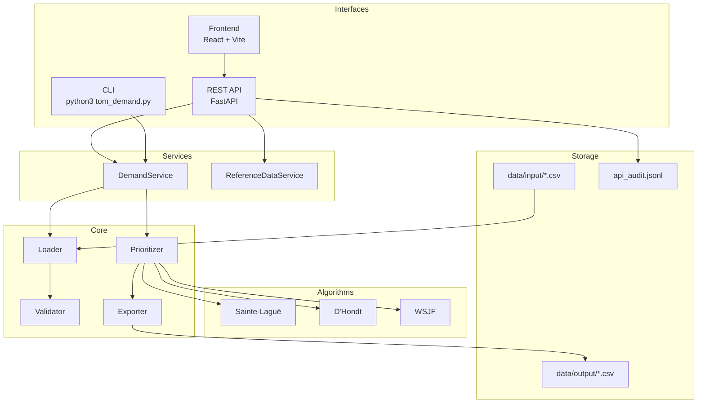
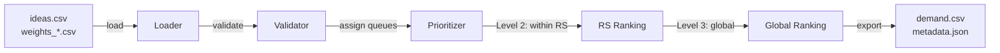
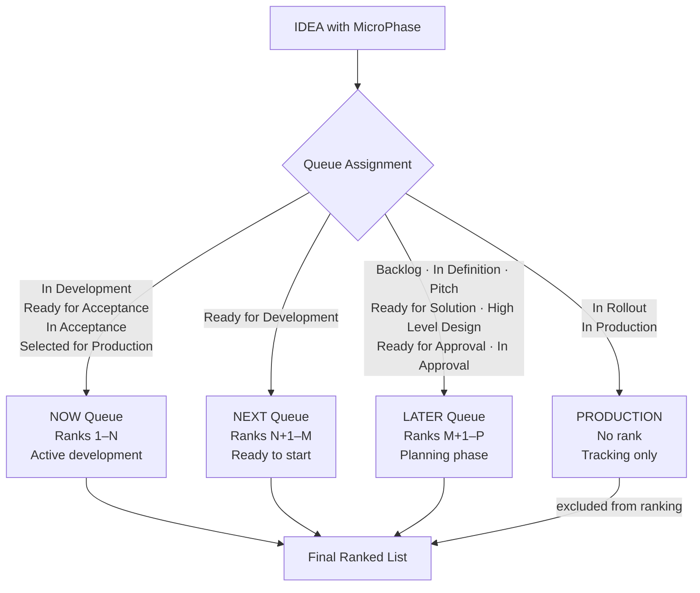
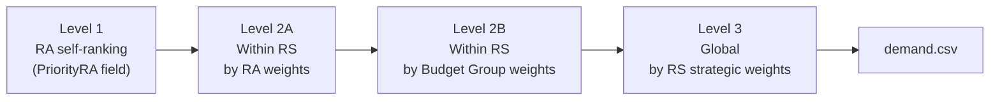

# Architecture

## System Overview

TOM Demand Management System is a CLI + REST API application for portfolio prioritization at CTT. It reads CSV data, validates it, applies proportional allocation algorithms across lifecycle queues, and outputs ranked CSV results.

## Data Flow

## Queue System

IDEAs are automatically assigned to queues based on their `MicroPhase` field. Queues are ranked sequentially — highest to lowest priority:

## Multi-Level Prioritization

## Module Responsibilities

| Module | Responsibility |
|--------|---------------|
| `src/loader.py` | Read CSVs, apply defaults, assign Queue from MicroPhase |
| `src/validator.py` | Validate IDEAS, weights, referential integrity, PriorityRA sequences |
| `src/prioritizer.py` | Orchestrate Level 2 → Level 3; dispatch to algorithms per queue |
| `src/algorithms/sainte_lague.py` | Odd-divisor proportional allocation (1, 3, 5…) |
| `src/algorithms/dhondt.py` | Natural-divisor allocation (1, 2, 3…) — reinforces dominant areas |
| `src/algorithms/wsjf.py` | (Value + Urgency + Risk) / Size, adjusted by weights |
| `src/exporter.py` | Format results, write CSVs (European format), write metadata JSON |
| `src/cli.py` | Click-based CLI — validate, prioritize, prioritize-rs, prioritize-global, compare |
| `src/services/demand_service.py` | Shared pipeline (load → validate → prioritize → export) used by CLI and API |
| `src/services/reference_data_service.py` | File-backed IDEAS and weight management for the API layer |
| `src/api/` | FastAPI app: CORS, auth, audit logging, async jobs, routers |

## Key Design Decisions

| Decision | Rationale |
|----------|-----------|
| CSV as source of truth | No database dependency; files are directly manageable |
| Shared `DemandService` | Single pipeline for CLI and API — prevents logic divergence |
| `print()` not logging | Intentional for CLI UX; API layer adds structured logging separately |
| try/except import fallback | Supports both `python3 tom_demand.py` (CLI) and `from src.xxx import ...` (API) — do not restructure imports without testing both modes |
| `PriorityRA == 999` filter | Silent "disabled" flag; IDEAs with this value are excluded from prioritization |
| `Weight == 999` filter | RAs with this RA weight are excluded entirely; their IDEAs are skipped with a warning |
| Auth disabled by default | Set `AUTH_ENABLED=true` to enable API key + role authentication |
